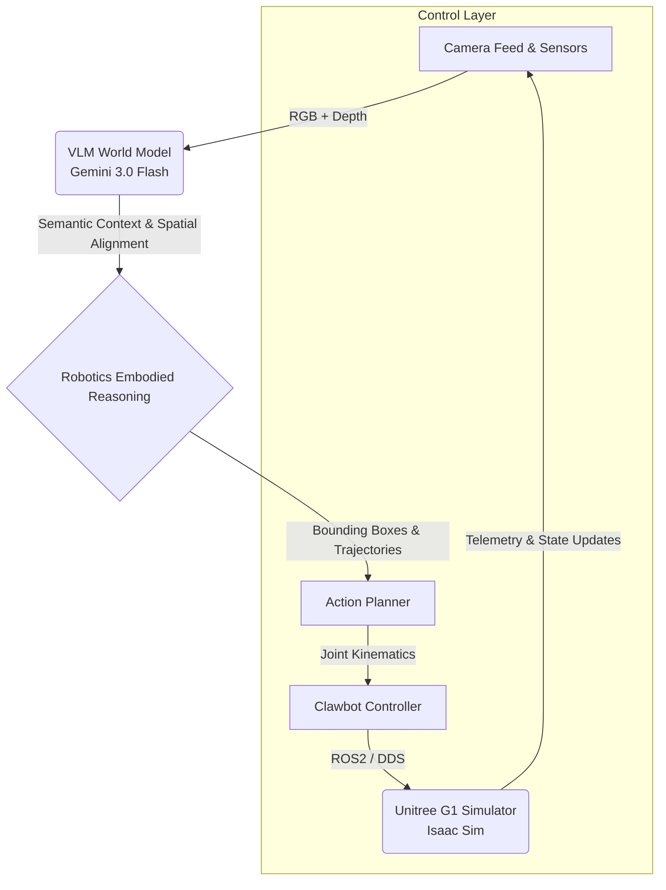
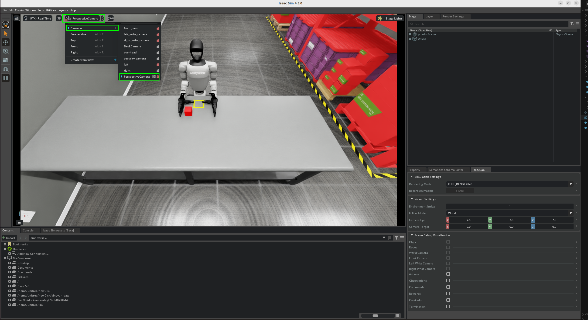
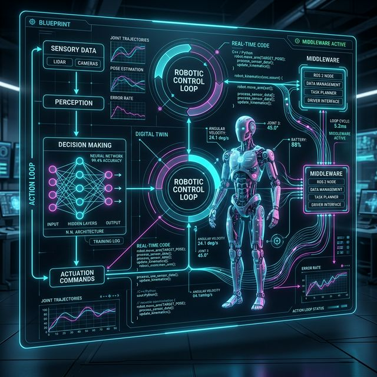
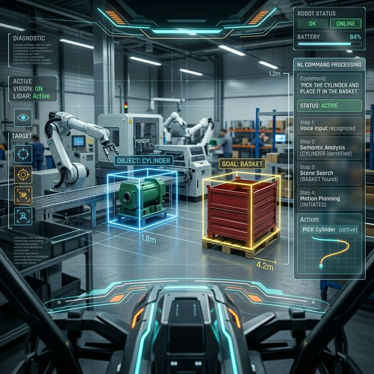
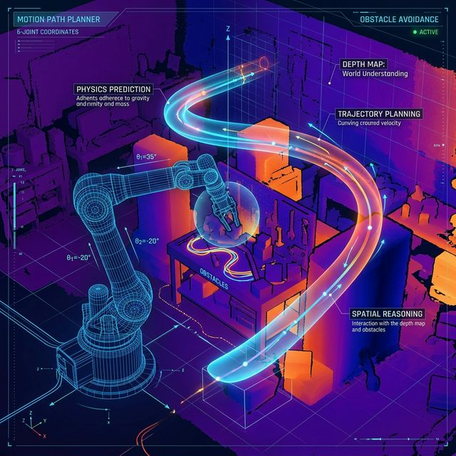

# Unitree G1 Clawbot - StrikeRobot Integration

Hey everyone, it's Ben from StrikeRobot.
So over the last few days, we ran a little experiment. We took Openclaw and put it on a Unitree G1 humanoid robot — inside a factory simulation — just to see what it could do.
The task was simple. We typed one line: "pick and place the cylinder into the basket." That's it. No code. No programming. Just plain text — and the robot handles everything else from there.

So here's what's actually happening behind the scenes:
First, we have Gemini Flash 3.0 acting as the eyes and brain. It looks at the workspace, spots the objects, and understands where everything is and what needs to happen. Then we have Gemini's Robotics Embodied Reasoning model — this one takes that understanding and breaks it down into actual physical steps. It figures out how to move, and even predicts where things might shift during the task.

Together, we have a Clawbot controller for humanoid.

There are three things Clawbot is doing at the same time:
1. It's reading your intent from plain language.
2. It's talking to the robot's hardware over ROS2/DDS — coordinating all the joints in real time.
3. And if anything is unclear or something gets in the way, the robot just… asks. It pauses and checks in before it continues.

And then finally — the arm moves. The system plots a smooth, optimized path, and makes tiny millisecond corrections the whole way through, so every pick is clean and every placement is exact.

That's the full loop - happy to open-source everything, follow us to see more complicated tasks coming soon.

---

## 🌍 Powered by VLM World Model Architecture
Clawbot bridges the gap between high-level reasoning and low-level physical actuation by leveraging a cutting-edge **Vision-Language Model (VLM) functioning as a World Model**.

This enables the robot to intimately understand its environment without explicit prior mapping. The Gemini Flash 3.0 and Robotics Embodied Reasoning models collaboratively form a 'world understanding' layer that predicts physical consequences, understands 3D spatial alignment purely from a 2D camera feed and simulated depth maps, and intelligently corrects trajectory waypoints in real-time. Action planning becomes organic, aware of gravity, object boundaries, and collision risks.

### 🧠 System Flow Diagram



---

## 🛠 Clawbot Operator Guide

The **Clawbot Controller** (`strike_robot_clawbot.py`) acts as the central brain pipeline, directly interfacing with the Unitree G1 environment in Isaac Sim. 

<div align="center">
    
    
    <br/>
    <i>Simulated Unitree G1 Workspace & First-Person Robot Vision View</i>
</div>

### 1. Prerequisites (Starting the Simulator)
Before initializing the AI brain pipeline, you must ensure the Unitree G1 simulation is up and running. Open a terminal, activate your Isaac Sim environment, and run:
```bash
python sim_main.py --task Isaac-PickPlace-Cylinder-G129-Dex1-Joint --enable_dex1_dds --robot_type g129
```

### 2. Launching the Clawbot
In a fresh terminal, export your Gemini API key (required to power the VLM World Model) and start the main executable:

```bash
export GEMINI_API_KEY="your-api-key-here"
python strike_robot_clawbot.py
```

### 3. Execution & HUD Interface
Once the controller connects to Isaac Sim over the local network, you will see a Head-Up Display (HUD) utilizing OpenCV:
- **RGB Window**: First-person visual feed, enriched with `Bounding Boxes` (Magenta borders) and trajectory predictions mapped by the Robotics Embodied Reasoning pipeline.
- **Depth Map Window**: A real-time heatmap visualization assisting the AI in establishing 3D bounds (`Z` coordinates).

In the **AI Autopilot Mode**, the system executes an autonomous loop every 3 seconds:
1. Grabs RGB and Depth Map frames.
2. Feeds vision data to the **Gemini Robotics-ER** model to localize target bounding boxes (Cylinder, Basket, Gripper).
3. Generates 3D spatial trajectory waypoints connecting the objects.
4. Downscales waypoints into an actionable sequence of precise joint manipulations.
5. Sends finalized commands via DDS to the Unitree G1 engine.

---

## 🔬 Architectural Analysis: Clawbot, VLM, and World Model

Why did we choose this exact AI stack over traditional robotics pipelines? The answer lies in the monumental shift from **rigid programming** to **dynamic comprehension**. Below is an in-depth analytical breakdown of the three core pillars driving the Unitree G1 operation.

### 1. The Clawbot Framework: AI-Native Middleware
<div align="center">
    
    <br/>
    <i>Visualizing the Perception-Action Loop and Middleware Orchestration</i>
</div>

Traditional robotic operations rely heavily on deterministic state machines (e.g., standard ROS2 operation parameters) and hard-coded motion planning frameworks like MoveIt!. While precise, these legacy systems are inherently brittle. If a target object is accidentally nudged 5 centimeters to the left mid-grasp, a traditional pre-calculated trajectory will miss entirely, often requiring an emergency halt and an expensive computational re-plan cycle.

**Why Clawbot?**
Clawbot was intentionally engineered as an AI-native translation layer. It abandons strict state-machine rigidity in favor of a continuous *perception-action loop*. It efficiently orchestrates the massive flow of multimodal data—pulling raw virtual camera feeds and joint states from the Isaac Sim environment—and rapidly pushes real-time joint kinematic corrections across ROS2/DDS. Because Clawbot interfaces directly with the AI reasoning backbone every few milliseconds, it inherently supports dynamic recalibration. If an object rolls away, Clawbot doesn't "fail"; it just continuously tracks and fluidly adjusts the Unitree G1's arm in real-time, matching human-like adaptability.

### 2. Vision-Language Model (VLM) Integration: Zero-Shot Perception
<div align="center">
    
    <br/>
    <i>Real-time Semantic Labeling and Natural Language Command Mapping</i>
</div>

In classic computer vision paradigms, identifying a "basket" or a "cylinder" mandates training a dedicated YOLO or Mask R-CNN network. This equates to spending weeks annotating thousands of images encompassing specific lighting conditions and angles. Furthermore, if you suddenly ask the rigid robot to "pick up the wrench," it fails completely because "wrench" was never in its strictly curated training classes.

**Why Gemini Flash 3.0?**
By integrating a state-of-the-art VLM, the robot instantly gains **open-vocabulary semantic understanding** and **zero-shot generalization capabilities**. 
- **The Justification**: We chose this specifically to avoid massive dataset curation. Instead of writing a complex Python script that reads `find_object_id(12) -> goto(x, y)`, the operator simply types in plain English: *"Pick up the metallic cylinder and carefully drop it into the blue basket."*
- **The Impact**: The VLM doesn't just process pixel colors; it intrinsically understands the linguistic *concept* of the object and maps it functionally to visual bounding boxes. We bypassed months of dataset training because the VLM already fundamentally knows what a cylinder is, enabling instant deployment in totally novel task arrays.

### 3. Embodied World Model: Synthesizing Physics from Pixels
<div align="center">
    
    <br/>
    <i>Internal Physics Simulation and 3D Trajectory Hallucination from 2D Feeds</i>
</div>

The most critical and futuristic innovation in this pipeline is the **Embodied World Model**. Historically, to teach a robot how to pick up an object dynamically, engineers relied on Deep Reinforcement Learning (DRL). DRL requires millions of simulated runtime episodes, wherein a digital agent randomly moves its arm, knocking the cylinder over 100,000 times before "learning" the correct approach angle through agonizing trial and error.

**Why Gemini Robotics-ER (Embodied Reasoning)?**
A World Model is not merely a chat-based LLM; it is an intelligence layer that **simulates physics internally**. Through the Robotics-ER integration, the robot synthesizes a predictive physics environment internally from mere 2D pixel arrays and depth maps.

- **Spatial Reasoning Without LIDAR**: The World Model intelligently estimates spatial volumetric relationships purely from camera feeds. It mathematically deduces how far the gripping manipulator must travel in the Z-axis without ever relying on expensive, heavy, and power-hungry LIDAR sensors.
- **Physical Anticipation (Hallucination)**: Before sending a single joint command to the actuators, the model "hallucinates" the spatial consequences of its trajectory. It conceptually knows that approaching a tall, standing cylinder from the top might tip it over. Therefore, it autonomously plots a 3D arc that approaches from the side, anticipating how payloads might shift upon contact constraints.
- **Organic Action Planning (Overcoming Inverse Kinematics)**: Rather than relying on computationally heavy classical Inverse Kinematics (IK) algorithms to solve matrix puzzles in a mathematical vacuum, the World Model generates direct actuation "steps" (e.g., *adjust pitch down by 0.2 rads, yaw left, secure Dex1 gripper*). This directly maps cognitive intent to physical embodiment, allowing the 29-DOF Unitree G1 humanoid to overcome hardware latencies and move with a sense of "awareness" of its own body. 

This trifold synthesis—Clawbot's malleable structural piping, VLM's semantic sight, and the World Model's physical simulation—creates a robot that doesn't just blindly move to coordinates, but genuinely *understands* its task domain.
